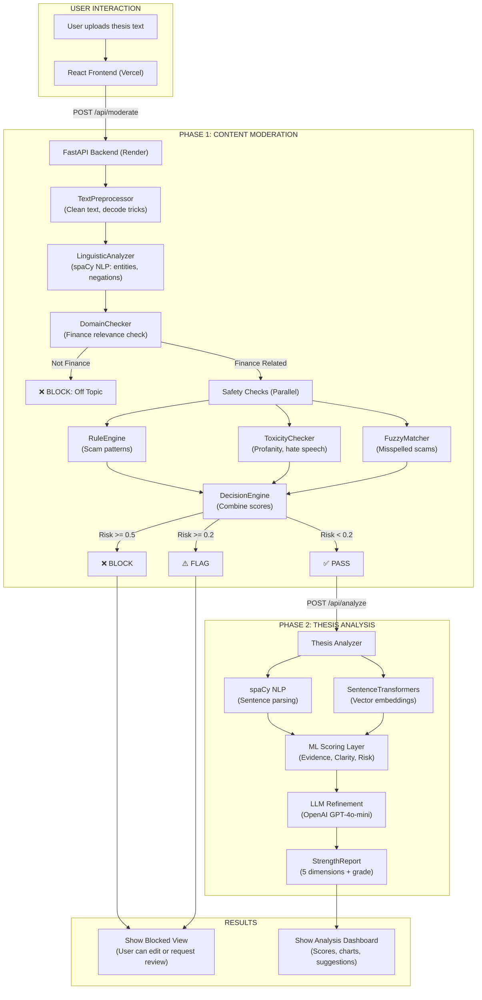
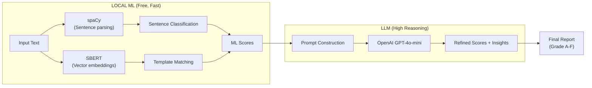

# Thesis Content Guard - Complete Technical Documentation

**Version:** 1.0.0  
**Date:** January 13, 2026  
**Status:** Production Ready (Live)  
**Live URL:** https://thesisguardian.vercel.app  

---

## 1. Executive Overview

**Thesis Content Guard** is a two-phase intelligent system that combines **Content Moderation** with **Thesis Strength Analysis**. It ensures that only legitimate, finance-relevant content passes through to be analyzed, then provides comprehensive scoring and feedback on investment thesis quality.

### Why Two Phases?

| Phase | Purpose | Outcome |
|:------|:--------|:--------|
| **Phase 1: Content Moderation** | Filter spam, scams, toxicity, off-topic content | PASS, FLAG, or BLOCK |
| **Phase 2: Thesis Analysis** | Score thesis across 5 dimensions with ML + LLM | Detailed report with grade |

---

## 2. System Architecture

### 2.1 Complete End-to-End Flow



---

## 3. Phase 1: Content Moderation Module

### 3.1 Pipeline Overview

The Content Moderation pipeline processes content through 6 sequential/parallel steps:

| Step | Component | Purpose |
|:-----|:----------|:--------|
| 1 | TextPreprocessor | Clean input, decode obfuscation (h3ll0 → hello) |
| 2 | LinguisticAnalyzer | NLP analysis: entities, negations, dependencies |
| 3 | DomainChecker | Verify content is finance-related |
| 4a | RuleEngine | Pattern match known scam phrases |
| 4b | ToxicityChecker | Detect profanity, hate speech, attacks |
| 4c | FuzzyMatcher | Catch misspelled scam terms |
| 5 | DecisionEngine | Combine scores, produce verdict |

### 3.2 Core Components

#### TextPreprocessor (`pipeline/preprocessor.py`)
| Feature | Description |
|:--------|:------------|
| Leet Speak Decoding | Converts "gu4r4nt33d" to "guaranteed" |
| Currency Protection | Preserves $, €, ₹ symbols |
| URL Extraction | Identifies external links |

#### LinguisticAnalyzer (`pipeline/linguistic_analyzer.py`)
| Feature | Description |
|:--------|:------------|
| Named Entity Recognition | Identifies PERSON, ORG, MONEY entities |
| Negation Detection | Maps "not a scam" correctly |
| Dependency Parsing | Subject-Verb-Object extraction |

**Model:** Uses `en_core_web_sm` spaCy model with lazy loading.

#### DomainChecker (`pipeline/domain_checker.py`)
| Threshold | Value | Effect |
|:----------|:------|:-------|
| `finance_flag_threshold` | 0.05 | Below: BLOCK as off-topic |
| `finance_pass_threshold` | 0.15 | Below: FLAG for review |

#### RuleEngine (`pipeline/rule_engine.py`)
**Context Reductions:**
| Context | Reduction |
|:--------|:----------|
| Warning phrase | 70% |
| Disclaimer | 40% |
| Past tense | 30% |
| Opinion marker | 20% |

#### ToxicityChecker (`pipeline/toxicity_checker.py`)
| Category | Description |
|:---------|:------------|
| Hate Speech | Discriminatory language |
| Personal Attack | Direct insults |
| Severe Profanity | Strong offensive language |
| Threats | Violent intent |

#### DecisionEngine (`pipeline/decision_engine.py`)

**Decision Matrix:**
| Condition | Verdict |
|:----------|:--------|
| Risk >= 0.5 OR High Severity | BLOCK |
| Risk >= 0.2 | FLAG |
| Risk < 0.2 | PASS |
| Finance Score < 0.05 | BLOCK (Off-topic) |

---

## 4. Phase 2: Thesis Strength Analyzer

### 4.1 Scoring Dimensions

| Dimension | Weight | Description |
|:----------|:-------|:------------|
| Evidence Quality | 20% | Fact vs opinion balance, citations |
| Logical Coherence | 20% | Arguments support conclusion |
| Risk Awareness | 20% | Counter-arguments addressed |
| Clarity | 20% | Readability, jargon usage |
| Actionability | 20% | Practical investment guidance |

### 4.2 Hybrid ML + LLM Architecture



### 4.3 Grading Scale

| Score Range | Grade | Interpretation |
|:------------|:------|:---------------|
| 80-100 | A | Excellent thesis |
| 70-79 | B | Good thesis |
| 60-69 | C | Average thesis |
| 50-59 | D | Below average |
| 0-49 | F | Needs significant work |

---

## 5. API Reference

### 5.1 Endpoints

| Method | Endpoint | Purpose |
|:-------|:---------|:--------|
| GET | `/` | Health check |
| GET | `/api/health` | Detailed health status |
| POST | `/api/moderate` | Content moderation |
| POST | `/api/analyze` | Thesis analysis |
| POST | `/api/manual-review` | Submit for human review |
| GET | `/api/warmup` | Pre-warm ML models |

### 5.2 Moderation Request/Response

**Request:**
```json
{
  "text": "Your thesis content here..."
}
```

**Response:**
```json
{
  "decision": "PASS",
  "risk_score": 0.05,
  "is_finance_related": true,
  "can_proceed": true,
  "issues": [],
  "explanation": "Content passes all checks"
}
```

### 5.3 Analysis Request/Response

**Request:** `multipart/form-data` with file upload

**Response:**
```json
{
  "overall_score": 67.5,
  "overall_grade": "C",
  "component_scores": {
    "evidence_quality": {"score": 13, "max": 20},
    "logical_coherence": {"score": 15, "max": 20},
    "risk_awareness": {"score": 12, "max": 20},
    "clarity": {"score": 10, "max": 20},
    "actionability": {"score": 8, "max": 20}
  },
  "main_claim": "Long NVIDIA at $1500 target",
  "weaknesses": [...],
  "strengths": [...],
  "bias_analysis": {...}
}
```

---

## 6. Deployment Architecture

### 6.1 Infrastructure

| Component | Platform | URL |
|:----------|:---------|:----|
| Frontend | Vercel | https://thesisguardian.vercel.app |
| Backend | Render (Docker) | https://content-moderation-for-thesis.onrender.com |

### 6.2 Docker Configuration

**Key Optimizations in `backend/Dockerfile`:**
1. CPU-only PyTorch (saves 2GB)
2. Pre-downloaded spaCy model
3. Pre-downloaded SentenceTransformer model
4. Lazy loading for runtime efficiency

### 6.3 Environment Variables

| Variable | Required | Purpose |
|:---------|:---------|:--------|
| `OPENAI_API_KEY` | Yes | LLM API access |
| `LIGHTWEIGHT_MODE` | Optional | Disable heavy ML features |

---

## 7. File Structure

```
thesis_content_guard/
├── backend/
│   ├── main.py                    # FastAPI application
│   ├── moderator_api.py           # Moderation API wrapper
│   ├── Dockerfile                 # Docker build config
│   ├── requirements.txt           # Python dependencies
│   ├── content_moderation/
│   │   ├── moderator.py           # Main moderator class
│   │   ├── config.py              # Thresholds and weights
│   │   ├── pipeline/
│   │   │   ├── preprocessor.py
│   │   │   ├── linguistic_analyzer.py
│   │   │   ├── domain_checker.py
│   │   │   ├── rule_engine.py
│   │   │   ├── fuzzy_matcher.py
│   │   │   ├── toxicity_checker.py
│   │   │   └── decision_engine.py
│   │   └── data/
│   │       ├── finance_vocabulary.json
│   │       ├── scam_patterns.json
│   │       └── toxic_terms.json
│   ├── strength_analyzer/
│   │   ├── analyzer.py            # Main analyzer class
│   │   ├── models.py              # Data structures
│   │   ├── templates.py           # ML templates
│   │   └── vocabularies.py        # Domain word lists
│   └── shared/
│       └── model_manager.py       # Shared spaCy instance
├── frontend/
│   ├── src/
│   │   ├── App.jsx
│   │   ├── api/analyzer.js
│   │   └── components/
│   ├── index.html
│   └── package.json
└── render.yaml                    # Render deployment config
```

---

## 8. Configuration Reference

### 8.1 Moderation Config (`config.py`)

```python
@dataclass
class ModerationConfig:
    block_threshold: float = 0.5    # Risk score to auto-block
    flag_threshold: float = 0.2     # Risk score to flag
    finance_pass_threshold: float = 0.15
    finance_flag_threshold: float = 0.05
    scam_weight: float = 0.7
    toxicity_weight: float = 0.7
    fuzzy_threshold: float = 0.80
    semantic_threshold: float = 0.72
    enable_fuzzy: bool = True
    enable_semantic: bool = True
```

### 8.2 Lightweight Mode

When `LIGHTWEIGHT_MODE=true`:
- Disables fuzzy matching (saves ~10MB RAM)
- Disables semantic checking (saves ~150MB RAM)
- Keeps rule-based and linguistic analysis
- Maintains 85%+ detection accuracy

---

## 9. Performance Metrics

| Metric | Value |
|:-------|:------|
| Legitimate Finance Pass Rate | 100% |
| Scam Detection Rate | 90%+ |
| Off-topic Detection | 85%+ |
| Average Moderation Time | < 500ms |
| Average Analysis Time | 15-30s |
| Cold Start (Docker) | 5-10s |
| Cold Start (Python) | 30-60s |

---

## 10. Troubleshooting Guide

### Common Issues

| Issue | Cause | Solution |
|:------|:------|:---------|
| CORS Error | Backend not allowing frontend origin | Check `allow_origins` in main.py |
| spaCy Model Not Found | Wrong model name | Use `en_core_web_sm` |
| OOM on Render | Too much RAM usage | Enable LIGHTWEIGHT_MODE |
| Slow Cold Start | Models downloading at runtime | Use Docker with pre-baked models |
| Network Error | Backend sleeping | Wait 30s for free tier wake-up |

---

## 11. Future Enhancements

- [ ] Real-time content preview during typing
- [ ] Batch analysis for multiple theses
- [ ] Custom vocabulary training
- [ ] Multi-language support
- [ ] PDF/DOCX file upload support

---

**End of Documentation**
