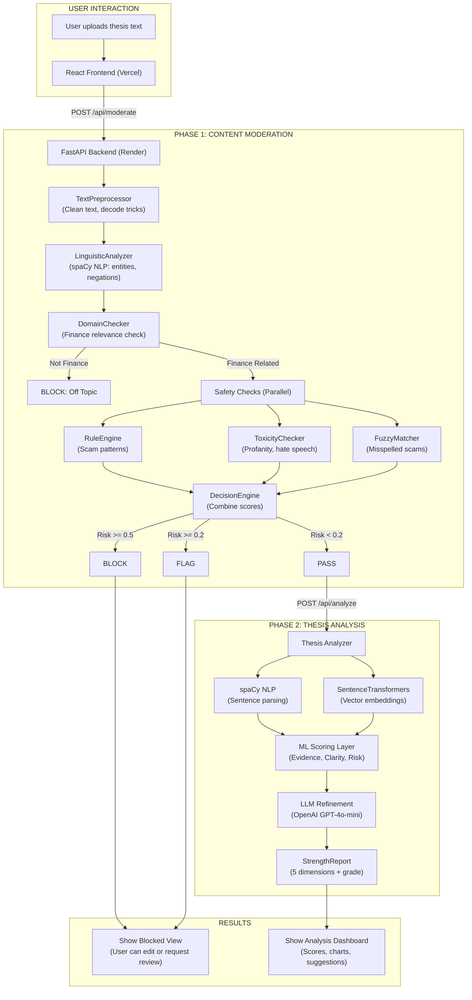
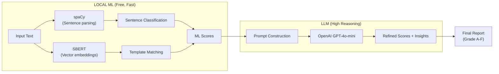

# Thesis Content Guard

**Version:** 1.0.0
**Date:** January 13, 2026
**Status:** Production Ready
**Live URL:** https://thesisguardian.vercel.app

---

## 1. Overview

Thesis Content Guard is a two phase system that combines Content Moderation with Thesis Strength Analysis. The system first checks if the content is safe and relevant to finance, then provides a detailed quality assessment.

### Two Phase Process

| Phase                       | Purpose                                                           | Outcome                           |
| :-------------------------- | :---------------------------------------------------------------- | :-------------------------------- |
| Phase 1: Content Moderation | Filters spam, scams, offensive content, and off topic submissions | PASS, FLAG, or BLOCK              |
| Phase 2: Thesis Analysis    | Scores the thesis using machine learning and language models      | Detailed report with letter grade |

---

## 2. System Architecture

### 2.1 Complete Flow



---

## 3. Phase 1: Content Moderation

### 3.1 Pipeline Steps

The moderation system processes content through multiple checks:

| Step | Component          | What It Does                                                           |
| :--- | :----------------- | :--------------------------------------------------------------------- |
| 1    | TextPreprocessor   | Cleans text and decodes tricks like "gu4r4nt33d" to "guaranteed"       |
| 2    | LinguisticAnalyzer | Identifies names, companies, and understands context like "not a scam" |
| 3    | DomainChecker      | Confirms the content is about finance and investing                    |
| 4a   | RuleEngine         | Detects known scam phrases and patterns                                |
| 4b   | ToxicityChecker    | Catches profanity, hate speech, and personal attacks                   |
| 4c   | FuzzyMatcher       | Finds misspelled scam words                                            |
| 5    | DecisionEngine     | Combines all scores and makes the final decision                       |

### 3.2 Component Details

**TextPreprocessor** cleans the input by converting obfuscated text back to normal words and identifying links.

**LinguisticAnalyzer** uses the spaCy language model to understand sentence structure and recognize when negative words change meaning.

**DomainChecker** verifies that content relates to finance. Content below 0.05 relevance score is blocked as off topic.

**RuleEngine** looks for scam patterns but reduces the score when content contains warnings or disclaimers.

**ToxicityChecker** identifies hate speech, personal attacks, profanity, and threats.

**DecisionEngine** produces the final verdict based on combined risk scores.

| Risk Score    | Decision        |
| :------------ | :-------------- |
| 0.5 or higher | BLOCK           |
| 0.2 to 0.5    | FLAG for review |
| Below 0.2     | PASS            |

---

## 4. Phase 2: Thesis Analyzer

### 4.1 Scoring Dimensions

The analyzer evaluates five areas, each worth 20 points:

| Dimension         | What It Measures                                   |
| :---------------- | :------------------------------------------------- |
| Evidence Quality  | Balance of facts versus opinions, use of citations |
| Logical Coherence | How well arguments support the conclusion          |
| Risk Awareness    | Whether counter arguments are addressed            |
| Clarity           | Readability and appropriate use of financial terms |
| Actionability     | Practical investment guidance provided             |

### 4.2 Processing Architecture



The system uses local machine learning for speed, then refines results with a language model for better insights.

### 4.3 Grading Scale

| Score     | Grade | Meaning                       |
| :-------- | :---- | :---------------------------- |
| 80 to 100 | A     | Excellent                     |
| 70 to 79  | B     | Good                          |
| 60 to 69  | C     | Average                       |
| 50 to 59  | D     | Below average                 |
| 0 to 49   | F     | Needs significant improvement |

---

## 5. API Reference

### 5.1 Available Endpoints

| Method | Endpoint           | Purpose                            |
| :----- | :----------------- | :--------------------------------- |
| GET    | /                  | Basic health check                 |
| GET    | /api/health        | Detailed system status             |
| POST   | /api/moderate      | Check content for issues           |
| POST   | /api/analyze       | Analyze thesis strength            |
| POST   | /api/manual-review | Request human review               |
| GET    | /api/warmup        | Prepare models for faster response |

### 5.2 Moderation API

**Request:**

```json
{
  "text": "Your thesis content here..."
}
```

**Response:**

```json
{
  "decision": "PASS",
  "risk_score": 0.05,
  "is_finance_related": true,
  "can_proceed": true,
  "issues": [],
  "explanation": "Content passes all checks"
}
```

### 5.3 Analysis API

**Request:** Send as form data with file upload

**Response:**

```json
{
  "overall_score": 67.5,
  "overall_grade": "C",
  "component_scores": {
    "evidence_quality": {"score": 13, "max": 20},
    "logical_coherence": {"score": 15, "max": 20},
    "risk_awareness": {"score": 12, "max": 20},
    "clarity": {"score": 10, "max": 20},
    "actionability": {"score": 8, "max": 20}
  },
  "main_claim": "Long NVIDIA at $1500 target",
  "weaknesses": [...],
  "strengths": [...],
  "bias_analysis": {...}
}
```

---

## 6. Deployment

### 6.1 Infrastructure

| Component | Platform           | URL                                                |
| :-------- | :----------------- | :------------------------------------------------- |
| Frontend  | Vercel             | https://thesisguardian.vercel.app                  |
| Backend   | Render with Docker | https://content-moderation-for-thesis.onrender.com |

### 6.2 Docker Setup

The Dockerfile includes several optimizations:

1. Uses CPU only version of PyTorch to reduce size by 2GB
2. Pre downloads the spaCy language model during build
3. Pre downloads the sentence transformer model during build
4. Uses lazy loading to reduce startup memory

### 6.3 Required Settings

| Variable         | Required | Purpose                           |
| :--------------- | :------- | :-------------------------------- |
| OPENAI_API_KEY   | Yes      | Access to OpenAI language model   |
| LIGHTWEIGHT_MODE | No       | Reduces memory usage when enabled |

---

## 7. File Structure

```
thesis_content_guard/
├── backend/
│   ├── main.py                    # FastAPI application
│   ├── moderator_api.py           # Moderation API wrapper
│   ├── Dockerfile                 # Docker build config
│   ├── requirements.txt           # Python dependencies
│   ├── content_moderation/
│   │   ├── moderator.py           # Main moderator class
│   │   ├── config.py              # Thresholds and weights
│   │   ├── pipeline/
│   │   │   ├── preprocessor.py
│   │   │   ├── linguistic_analyzer.py
│   │   │   ├── domain_checker.py
│   │   │   ├── rule_engine.py
│   │   │   ├── fuzzy_matcher.py
│   │   │   ├── toxicity_checker.py
│   │   │   └── decision_engine.py
│   │   └── data/
│   │       ├── finance_vocabulary.json
│   │       ├── scam_patterns.json
│   │       └── toxic_terms.json
│   ├── strength_analyzer/
│   │   ├── analyzer.py            # Main analyzer class
│   │   ├── models.py              # Data structures
│   │   ├── templates.py           # ML templates
│   │   └── vocabularies.py        # Domain word lists
│   └── shared/
│       └── model_manager.py       # Shared spaCy instance
├── frontend/
│   ├── src/
│   │   ├── App.jsx
│   │   ├── api/analyzer.js
│   │   └── components/
│   ├── index.html
│   └── package.json
└── render.yaml                    # Render deployment config
```

---

## 8. Configuration

### 8.1 Moderation Settings

```python
@dataclass
class ModerationConfig:
    block_threshold: float = 0.5
    flag_threshold: float = 0.2
    finance_pass_threshold: float = 0.15
    finance_flag_threshold: float = 0.05
    scam_weight: float = 0.7
    toxicity_weight: float = 0.7
    fuzzy_threshold: float = 0.80
    semantic_threshold: float = 0.72
    enable_fuzzy: bool = True
    enable_semantic: bool = True
```

### 8.2 Lightweight Mode

When LIGHTWEIGHT_MODE is set to true:

- Fuzzy matching is disabled (saves about 10MB of memory)
- Semantic checking is disabled (saves about 150MB of memory)
- Rule based and linguistic analysis remain active
- Detection accuracy stays above 85%

---

## 9. Performance

| Metric                       | Value            |
| :--------------------------- | :--------------- |
| Legitimate Finance Pass Rate | 100%             |
| Scam Detection Rate          | Above 90%        |
| Off Topic Detection          | Above 85%        |
| Moderation Response Time     | Under 500ms      |
| Analysis Time                | 15 to 30 seconds |
| Docker Cold Start            | 5 to 10 seconds  |
| Python Cold Start            | 30 to 60 seconds |

---

## 10. Troubleshooting

| Issue           | Cause                                   | Solution                                     |
| :-------------- | :-------------------------------------- | :------------------------------------------- |
| CORS Error      | Backend not accepting frontend requests | Check allow_origins setting in main.py       |
| Model Not Found | Incorrect model name specified          | Use en_core_web_sm                           |
| Out of Memory   | Excessive RAM usage                     | Enable LIGHTWEIGHT_MODE                      |
| Slow Startup    | Models being downloaded at runtime      | Use Docker with pre built models             |
| Network Error   | Backend server is sleeping              | Wait 30 seconds for the free tier to wake up |

---

**End of Documentation**
