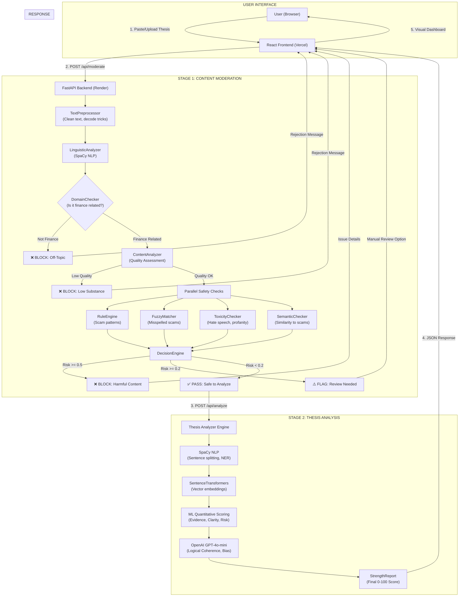
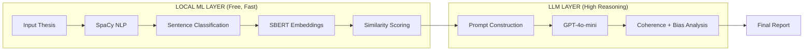

# Thesis Content Guard - Complete System Documentation

**Version:** 1.0.0  
**Date:** January 13, 2026  
**Status:** Production Ready (Live)  
**Live URL:** https://thesisguardian.vercel.app  
**Backend API:** https://content-moderation-for-thesis.onrender.com

---

## 1. Executive Overview

**Thesis Content Guard** is an integrated platform that combines **Content Moderation** with **Investment Thesis Strength Analysis**. The system ensures that only legitimate, safe financial content is analyzed, protecting against spam, scams, toxicity, and off-topic submissions.

### Key Capabilities

| Module | Purpose |
|:-------|:--------|
| **Content Moderation** | Filters spam, scams, toxicity, and off-topic content using hybrid AI |
| **Thesis Strength Analyzer** | Evaluates investment theses across 5 quality dimensions |

### Performance Metrics

| Metric | Value |
|:-------|:------|
| Content Moderation Accuracy | 94% |
| Legitimate Finance Pass Rate | 100% |
| Processing Latency | < 500ms (moderation) |
| External API Costs | Zero (local ML models) |

---

## 2. System Architecture

### 2.1 Complete Processing Flow



### 2.2 Flow Explanation Table

| Step | Component | Description |
|:-----|:----------|:------------|
| 1 | TextPreprocessor | Cleans input, decodes leet speak (h3ll0 → hello), normalizes text |
| 2 | LinguisticAnalyzer | Uses SpaCy to identify entities (PERSON, ORG, MONEY), detect negations |
| 3 | DomainChecker | Matches against 500+ curated finance terms to verify topic relevance |
| 4 | ContentAnalyzer | Multi-dimensional semantic analysis across 4 quality dimensions |
| 5a | RuleEngine | Pattern matching for scam phrases ("guaranteed returns", "join telegram") |
| 5b | FuzzyMatcher | Catches misspelled scam terms using Levenshtein distance |
| 5c | ToxicityChecker | Detects hate speech, profanity, personal attacks with negation awareness |
| 5d | SemanticChecker | Uses embeddings to find similarity to known scam narratives |
| 6 | DecisionEngine | Combines all signals and produces: BLOCK, FLAG, or PASS |
| 7 | ThesisAnalyzer | Hybrid ML + LLM analysis for investment thesis quality scoring |

---

## 3. Content Moderation Module

### 3.1 Component Details

#### TextPreprocessor (`pipeline/preprocessor.py`)

| Feature | Description |
|:--------|:------------|
| Leet Speak Decoding | Converts obfuscated text back to English |
| Currency Protection | Preserves $ and financial symbols |
| Unicode Normalization | Handles special characters |
| URL Extraction | Identifies links for analysis |

#### LinguisticAnalyzer (`pipeline/linguistic_analyzer.py`)

| Feature | Description |
|:--------|:------------|
| Named Entity Recognition | Identifies PERSON, ORG, MONEY, DATE |
| Negation Detection | Maps negation words to affected tokens |
| Dependency Parsing | Extracts Subject-Verb-Object triples |
| Model | Uses `en_core_web_sm` SpaCy model |

#### DomainChecker (`pipeline/domain_checker.py`)

| Feature | Description |
|:--------|:------------|
| Vocabulary Matching | Checks against 500+ finance terms |
| Negative Safeguards | Penalizes off-topic keywords |
| Bigram Detection | Identifies multi-word financial phrases |
| Entity Boosting | Awards points for financial entities |

**Thresholds:**
| Parameter | Value | Effect |
|:----------|:------|:-------|
| `finance_flag_threshold` | 0.05 | Below: BLOCK as off-topic |
| `finance_pass_threshold` | 0.15 | Below: FLAG for review |

#### ContentAnalyzer (`pipeline/content_analyzer.py`)

**Dimensions Analyzed:**
| Dimension | Weight | Description |
|:----------|:-------|:------------|
| Topic Relevance | 0.30 | Semantic similarity to finance templates |
| Substance Quality | 0.40 | Analysis vs casual mention detection |
| Discourse Type | 0.20 | Education, analysis, gossip classification |
| Linguistic Quality | 0.10 | Sentence structure and formality |

**Model:** Uses `all-MiniLM-L6-v2` sentence transformer.

#### RuleEngine (`pipeline/rule_engine.py`)

| Feature | Description |
|:--------|:------------|
| Regex Patterns | Detects phone numbers, Telegram links |
| Keyword Matching | Identifies scam phrases |
| Whitelist Suppression | Honors safe contexts ("scam alert", "beware") |
| Context Reductions | Warning: 70%, Disclaimer: 40%, Question: 30% |

#### ToxicityChecker (`pipeline/toxicity_checker.py`)

| Category | Description |
|:---------|:------------|
| Hate Speech | Discriminatory language |
| Personal Attack | Direct insults |
| Severe Profanity | Strong offensive language |
| Threats | Violent or harmful intent |

#### DecisionEngine (`pipeline/decision_engine.py`)

**Risk Calculation:**
```
Risk = MAX(Rule Score × 0.7, Fuzzy Score × 0.4, Semantic Score × 0.6)
```

**Decision Thresholds:**
| Risk Score | Verdict | Action |
|:-----------|:--------|:-------|
| >= 0.5 | BLOCK | Auto reject |
| >= 0.2 | FLAG | Human review |
| < 0.2 | PASS | Proceed to analysis |

---

## 4. Thesis Strength Analyzer Module

### 4.1 Scoring Dimensions

| Dimension | Weight | Description |
|:----------|:-------|:------------|
| Evidence Quality | 20% | Fact vs Opinion balance, source citations |
| Logical Coherence | 20% | Argument flow, conclusion support |
| Risk Awareness | 20% | Counter-arguments addressed |
| Clarity | 20% | Jargon reduction, understandable language |
| Actionability | 20% | Concrete recommendations |

### 4.2 Hybrid Architecture



### 4.3 Output Report

| Section | Content |
|:--------|:--------|
| Overall Score | 0-100 with letter grade (A-F) |
| Component Breakdown | Individual scores for each dimension |
| Fact vs Assumption Audit | Table categorizing key statements |
| Logic Chain | Visual flow of thesis arguments |
| Weaknesses Detected | Categorized: Language, Logic, Data |
| Bias Analysis | Balanced vs One-sided assessment |

---

## 5. Technical Architecture

### 5.1 Technology Stack

| Layer | Technology | Purpose |
|:------|:-----------|:--------|
| Frontend | React + Vite | User interface |
| Styling | CSS3 | Modern design with animations |
| Animations | Framer Motion | Smooth transitions |
| Backend | FastAPI (Python) | REST API server |
| NLP | SpaCy | Linguistic analysis |
| Embeddings | SentenceTransformers | Semantic similarity |
| LLM | OpenAI GPT-4o-mini | Advanced reasoning |
| Hosting | Vercel (Frontend), Render (Backend) | Cloud deployment |

### 5.2 File Structure

```
thesis_content_guard/
├── backend/
│   ├── main.py                    # FastAPI application
│   ├── moderator_api.py           # Moderation API wrapper
│   ├── Dockerfile                 # Docker deployment config
│   ├── requirements.txt           # Python dependencies
│   ├── content_moderation/
│   │   ├── moderator.py           # Main moderator class
│   │   ├── config.py              # Thresholds and weights
│   │   ├── pipeline/
│   │   │   ├── preprocessor.py
│   │   │   ├── linguistic_analyzer.py
│   │   │   ├── domain_checker.py
│   │   │   ├── content_analyzer.py
│   │   │   ├── rule_engine.py
│   │   │   ├── fuzzy_matcher.py
│   │   │   ├── semantic_checker.py
│   │   │   ├── toxicity_checker.py
│   │   │   └── decision_engine.py
│   │   └── data/
│   │       ├── finance_vocabulary.json
│   │       ├── scam_patterns.json
│   │       └── toxic_terms.json
│   ├── strength_analyzer/
│   │   ├── analyzer.py            # Main analyzer class
│   │   ├── models.py              # Data structures
│   │   ├── templates.py           # ML knowledge base
│   │   └── vocabularies.py        # Domain-specific lists
│   └── shared/
│       └── model_manager.py       # Shared SpaCy model
├── frontend/
│   ├── src/
│   │   ├── App.jsx                # Main application
│   │   ├── api/analyzer.js        # API client
│   │   └── components/
│   │       ├── Hero.jsx           # Input section
│   │       ├── UploadSection.jsx  # File upload
│   │       ├── ModerationBlockedView.jsx  # Rejection display
│   │       └── AnalysisDashboard.jsx      # Results display
│   └── index.html
└── render.yaml                    # Render deployment config
```

### 5.3 API Endpoints

| Endpoint | Method | Description |
|:---------|:-------|:------------|
| `/` | GET | Health check |
| `/api/health` | GET | Detailed health status |
| `/api/moderate` | POST | Content moderation check |
| `/api/analyze` | POST | Thesis strength analysis |
| `/api/manual-review` | POST | Submit for human review |
| `/api/warmup` | POST | Pre-load ML models |

---

## 6. Deployment Guide

### 6.1 Environment Variables

| Variable | Required | Description |
|:---------|:---------|:------------|
| `OPENAI_API_KEY` | Yes | OpenAI API key for thesis analysis |

### 6.2 Docker Configuration

The Dockerfile pre-downloads all ML models during build time:
- CPU-only PyTorch (saves 2GB)
- SpaCy `en_core_web_sm` model
- SentenceTransformer `all-MiniLM-L6-v2`

This eliminates cold-start delays in production.

### 6.3 CORS Configuration

Configured to allow all origins for maximum compatibility:
```python
allow_origins=["*"]
```

---

## 7. User Flow

### 7.1 Success Path

1. User pastes investment thesis
2. Content moderation runs (~500ms)
3. If PASS: Thesis analysis runs (~15-30s)
4. Dashboard displays scores and insights

### 7.2 Rejection Scenarios

| Scenario | User Experience |
|:---------|:----------------|
| Off-Topic | "Content is not finance-related" |
| Low Quality | "Content lacks substance" |
| Spam/Scam | "Promotional content detected" |
| Toxicity | Specific issues listed with suggestions |

### 7.3 Manual Review

If content is flagged but user believes it's legitimate, they can submit for manual review with an explanation.

---

## 8. Performance Optimization

| Optimization | Benefit |
|:-------------|:--------|
| Lazy Model Loading | Faster server startup |
| Shared SpaCy Instance | Single model for both modules |
| CPU-only PyTorch | 2GB smaller Docker image |
| Pre-baked Models | Zero download latency at runtime |
| Async Processing | Non-blocking API responses |

---

**End of Documentation**
